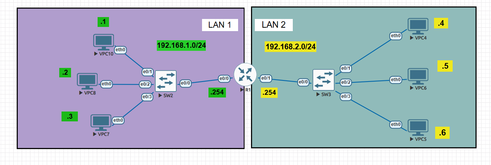

# 🖥️ Lab 01: IPv4 Addressing & Basic Routing

## 🎯 Objective
The primary goal of this lab is to understand basic IPv4 addressing, subnetting, and the role of a router in forwarding traffic between two distinct, directly connected Local Area Networks (LANs). 

## 🗺️ Topology Overview
The network consists of a central router (R1) connecting two separate broadcast domains (LAN 1 and LAN 2). 
* **LAN 1:** Operates on the `192.168.1.0/24` subnet.
* **LAN 2:** Operates on the `192.168.2.0/24` subnet.



## 📥 Download Lab
You can download the EVE-NG topology file here: 
[Download IPv4 Addressing Lab (.unl)](./IPv4 Addressing.unl)

## 📊 IP Addressing Table

| Device | Interface | IP Address | Subnet Mask | Default Gateway |
| :--- | :--- | :--- | :--- | :--- |
| **R1** | e0/0 | 192.168.1.254 | 255.255.255.0 | N/A |
| **R1** | e0/1 | 192.168.2.254 | 255.255.255.0 | N/A |
| **VPC10** | eth0 | 192.168.1.1 | 255.255.255.0 | 192.168.1.254 |
| **VPC8**  | eth0 | 192.168.1.2 | 255.255.255.0 | 192.168.1.254 |
| **VPC7**  | eth0 | 192.168.1.3 | 255.255.255.0 | 192.168.1.254 |
| **VPC4**  | eth0 | 192.168.2.4 | 255.255.255.0 | 192.168.2.254 |
| **VPC6**  | eth0 | 192.168.2.5 | 255.255.255.0 | 192.168.2.254 |
| **VPC5**  | eth0 | 192.168.2.6 | 255.255.255.0 | 192.168.2.254 |

## 🛠️ Configuration Tasks

1. **VPC Configuration:** * Assign the correct IPv4 addresses and subnet masks to all VPCs in LAN 1 and LAN 2.
   * Configure the correct Default Gateway for each VPC so they can reach the outside network.
2. **Router Configuration:**
   * Access R1 and configure interface `e0/0` with the IP address `192.168.1.254/24`.
   * Configure interface `e0/1` with the IP address `192.168.2.254/24`.
   * Ensure both interfaces are enabled using the `no shutdown` command.
3. **Verification & Testing:**
   * Verify direct connectivity: Ping from VPC10 to its gateway (192.168.1.254).
   * Verify inter-network routing: Ping from VPC10 (LAN 1) to VPC4 (LAN 2).
 ### 🧪 Verification & Packet Capture
 * Successful ICMP communication between LAN 2 (VPC6) and LAN 1 (192.168.1.1), along with Wireshark packet capture verifying the Echo Request and Echo Reply process.


## 🔍 Verification Commands
Use the following Cisco IOS commands on R1 to verify your configuration:
* `show ip interface brief`
* `show ip route`

## 💻 Device Configurations

### **R1 (Cisco Router)**
```text
enable
configure terminal
!
interface Ethernet0/0
 ip address 192.168.1.254 255.255.255.0
 no shutdown
!
interface Ethernet0/1
 ip address 192.168.2.254 255.255.255.0
 no shutdown
!
end
write memory
### **LAN 1 - VPC Configurations (192.168.1.0/24)**

```text
! VPC10 Configuration
ip 192.168.1.1 255.255.255.0 192.168.1.254
save

! VPC8 Configuration
ip 192.168.1.2 255.255.255.0 192.168.1.254
save

! VPC7 Configuration
ip 192.168.1.3 255.255.255.0 192.168.1.254
save
```

### **LAN 2 - VPC Configurations (192.168.2.0/24)**

```text
! VPC4 Configuration
ip 192.168.2.4 255.255.255.0 192.168.2.254
save

! VPC6 Configuration
ip 192.168.2.5 255.255.255.0 192.168.2.254
save

! VPC5 Configuration
ip 192.168.2.6 255.255.255.0 192.168.2.254
save
```
