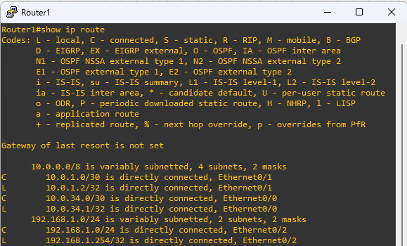
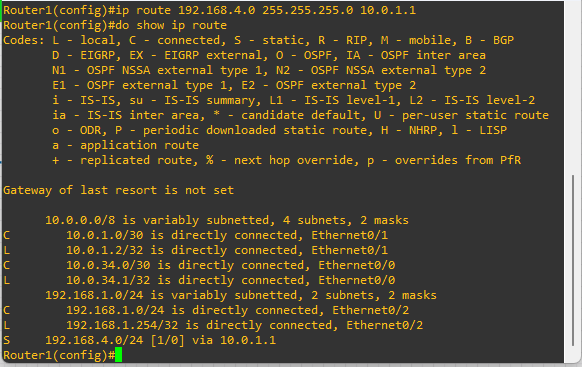
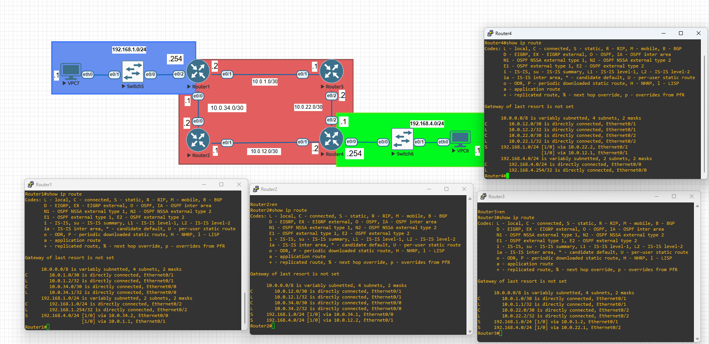
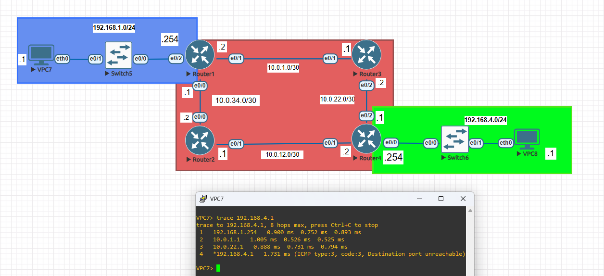

# 🛣️ Lab 02: Routing Fundamentals & Static Route 

## 📝 Overview
This lab marks the transition from simple Local Area Networks (LANs) to multi-router enterprise environments.
While basic connectivity relies on local switching, internetwork communication depends on a router's ability to make intelligent path decisions.
In this lab, we implement **Static Routing** to gain full control over traffic flow across multiple hops.

---

### 🔍 Understanding the Routing Table: "C" vs "L"
As soon as an interface is configured with an IP and brought `up`, two types of routes automatically appear in the routing table. Understanding the difference is vital for troubleshooting:



* **Connected (C):** This represents the **network segment** attached to the interface. 
  * *Example:* `C 192.168.1.0/24 is directly connected, Ethernet0/2`
  * *Purpose:* Tells the router that this entire subnet is reachable on this wire.
* **Local (L):** This is a **host route (/32)** representing the **specific IP address** assigned to the router's interface.
  * *Example:* `L 192.168.1.254/32 is directly connected, Ethernet0/2`
  * *Purpose:* Used by the router to process traffic destined *for the router itself* (like SSH or Ping to the gateway).


## 🧠 Core Concepts: How Routers Make Decisions
To master routing, one must understand the "Routing Logic." When a router receives a packet, it doesn't just guess where to send it; it follows a strict hierarchy of criteria:

1. **Longest Prefix Match:** The router always prefers the most specific route. For example, a route to `192.168.1.0/25` will always be chosen over `192.168.1.0/24` for a destination IP of `192.168.1.10`.
2. **Administrative Distance (AD):** This defines the "trustworthiness" of a route source. Lower is better.
   * **Directly Connected:** 0
   * **Static Route:** 1
   * **OSPF:** 110
   * In this lab we won't change AD of any routes it's going to explain in another lab. 
3. **Metric:** If multiple routes have the same AD, the router chooses the path with the lowest cost (bandwidth, hop count, etc.).
4. **Tie-Breaker: Equal Cost Multi-Path (ECMP)**
If both the Administrative Distance and the Metric are identical for multiple paths to the same destination, the router doesn't just pick one. Instead, it performs Load Balancing.
 This mechanism, known as ECMP, allows the router to install all equal-cost paths into the routing table and distribute traffic across them simultaneously, providing both redundancy and increased throughput.

### **Why Static Routing?**
* **Predictability:** You define the exact path traffic must take.
* **Low Resource Usage:** Unlike dynamic protocols (OSPF/BGP), static routes do not consume CPU cycles or link bandwidth for advertisements.
* **Security:** Prevents the router from learning potentially malicious routes from unauthorized neighbors.

---

## 🗺️ Topology Overview
Our topology features a 4-router core ring connecting two geographically or logically separated LANs.


### **Network Addressing Table (Subnets)**
| Network | Description | Segment Type |
| :--- | :--- | :--- |
| **192.168.1.0/24** | Blue LAN (Sales) | Access Subnet |
| **192.168.4.0/24** | Green LAN (HR) | Access Subnet |
| **10.0.1.0/30** | R1 ↔ R3 Link | Transit Link |
| **10.0.22.0/30** | R3 ↔ R4 Link | Transit Link |
| **10.0.12.0/30** | R4 ↔ R2 Link | Transit Link |
| **10.0.34.0/30** | R2 ↔ R1 Link | Transit Link |

---

## 🛠️ Configuration Tasks

### **1. Interface Configuration**
Before routing can occur, interfaces must be active and assigned the correct IP addresses. 
Example for **R1**:
```text
R1(config)# interface e0/1
R1(config-if)# ip address 10.0.1.1 255.255.255.252
R1(config-if)# no shutdown
```

### **2. Static Route Implementation**
By default, R1 only knows about its "Directly Connected" networks. To reach the Green LAN, we must manually inject a route pointing to the next-hop IP (R3's interface).
```text
Syntax: ip route [Destination_Network] [Mask] [Next-Hop_IP]
R1(config)# ip route 192.168.4.0 255.255.255.0 10.0.1.1
```


Note: Routing is a two-way street. For a ping to be successful, the destination router (R4) and all intermediate routers must have return routes back to the source network (192.168.1.0/24).



###***🧪 Verification & Troubleshooting***
Use these Cisco IOS commands to verify your routing table and path selection:

show ip route: View the routing table. Look for the "S" code indicating a Static route.

show ip interface brief: Confirm all transit interfaces are up/up.

ping 192.168.4.1: Verify end-to-end reachability between LANs.

traceroute 192.168.4.1: Trace the hop-by-hop path. Use this to confirm if traffic is taking the R3 path or the R2 path.




