# 🖧 🔀 Lab 03: VLANs & Inter-VLAN Routing


---

This project is a network topology designed to model fundamental switching concepts, VLAN configuration, and Router-on-a-Stick (ROAS) architecture for communication between different networks. It has been built and tested using Cisco IOL images on EVE-NG.

## 📖 Core Networking Concepts

To fully understand this lab, it is important to be familiar with the following key networking terminologies and concepts:

* **VLAN (Virtual Local Area Network):** A VLAN logically segments a single physical network into multiple distinct broadcast domains. We use VLANs to improve network security, enhance network performance by limiting broadcast traffic, and logically group devices or departments (e.g., Office, HR, Home) regardless of their physical connection to the switch.
* **Access Port:** A switch port configured to connect an end device (such as a PC, server, or printer). An access port can only belong to one specific VLAN at a time. The traffic entering or exiting this port is untagged.
* **Trunk Port:** A switch port used to interconnect switches or connect a switch to a router. Unlike an access port, a trunk port is designed to carry traffic for multiple VLANs simultaneously across a single physical link. It uses the **IEEE 802.1Q** encapsulation standard to "tag" Ethernet frames with their respective VLAN IDs, ensuring the receiving device knows which network the traffic belongs to.
* **Inter-VLAN Routing & ROAS (Router-on-a-Stick):** By design, devices in different VLANs cannot communicate with each other at Layer 2. To allow VLAN 10 to talk to VLAN 20 or 30, a Layer 3 device (a router) is required. **ROAS** is an efficient routing method where a single physical interface on a router is logically divided into multiple "sub-interfaces." Each sub-interface is assigned to a specific VLAN, tagged with 802.1Q, and acts as the Default Gateway for that network.

## 📌 Topology Diagram & Downloading LAB
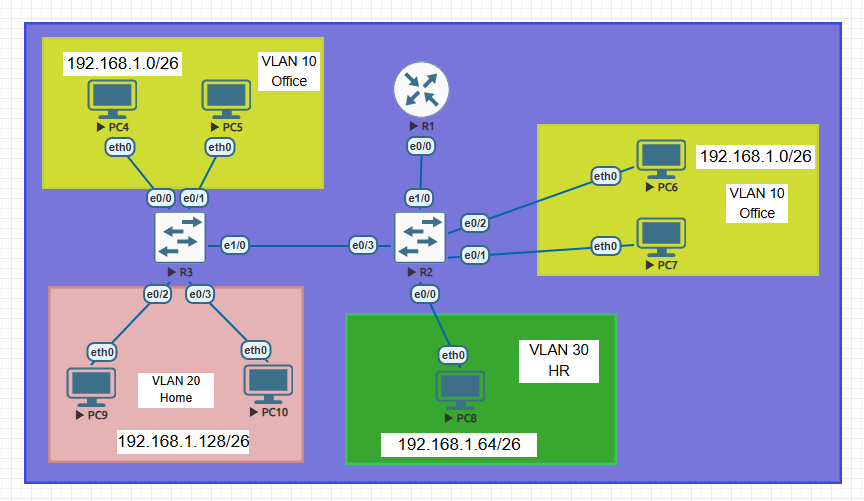 

[Download VLANs & Inter-VLAN Routing (.unl)](./VLAN.unl)

## 🏢 Network Architecture & VLAN Table

The network design involves subnetting a `192.168.1.0/24` address space into `/26` subnets (Subnet Mask: `255.255.255.192`).

| VLAN ID | Department | Network Address (Subnet) | Usable IP Range | Default Gateway |
| :--- | :--- | :--- | :--- | :--- |
| **VLAN 10** | Office | `192.168.1.0/26` | 192.168.1.1 - 192.168.1.62 | 192.168.1.62 |
| **VLAN 30** | HR | `192.168.1.64/26` | 192.168.1.65 - 192.168.1.126 | 192.168.1.126 |
| **VLAN 20** | Home | `192.168.1.128/26` | 192.168.1.129 - 192.168.1.190 | 192.168.1.190 |

## 🛠️ Device Roles & Connections

* **R1 (Router):** The core router configured for Inter-VLAN Routing (Router-on-a-Stick) to enable communication between isolated VLANs. It connects directly to the R2 switch.
* **SW1 & SW2 (Switches):** Although named R2 and R3 in the topology, these devices operate as Layer 2 Switches.
    * Since VLAN 10 spans across both switches, the link between them (R3 e1/0 <-> R2 e0/3) must be configured as an **802.1Q Trunk**.
    * All interfaces connecting to the end devices (PCs) are configured in **Access** mode.

## 🎯 Lab Objectives

The following objectives were achieved while building and configuring this topology:

1.  Creating and naming the required VLANs (10, 20, 30) on the switches.
2.  Configuring the end-device (PC) interfaces as `switchport mode access` and assigning them to their respective VLANs.
3.  Establishing an 802.1Q Trunk link between R2 and R3 to carry VLAN 10 traffic across the switches.
4.  Configuring the physical interface (e0/0) on router R1 with sub-interfaces, applying `encapsulation dot1Q`, and assigning the respective Default Gateway IP addresses.
5.  Verifying end-to-end connectivity between devices in different VLANs using ICMP (ping).

## 🛠️ Step-by-Step Configuration Guide

* In this lab, we leave the VPC IP, default gateway assignments, and router interface IP assignments up to you.
* Assuming you have completed the configurations mentioned above, let's begin the configurations step by step.

* First, let's look at the VLANs on our switch. Currently, the default VLANs are VLAN1, 1002, and 1005. We will change the port modes and create the VLANs step by step.
---
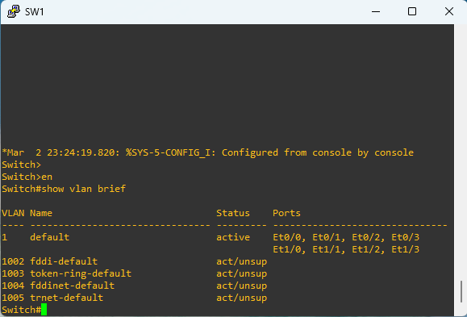
---
* Let's begin!

* First, let's configure the ports connected to the VLAN 10 end-hosts as Access ports. As mentioned earlier, Access ports are the ports that connect end-hosts such as PCs, Servers, and Printers to our switches.
* To reiterate why we configure them as Access ports: Access ports are ports that do not perform VLAN tagging.
* This means that we know the links connecting us to our devices in VLAN 10 will not carry another alternative VLAN, so we configure these ports as Access ports.
* VLAN tagging is costly. Although the cost is small, we should avoid it.
* Let's enter interface-config mode in VLAN 10 and configure our ports as Access ports.
* The command we will use to define a port as an Access port is as follows:

```text
SW1(config)# interface e0/0
SW(config-if)# switchport mode access
```
Now let's check if our switchport is actually an access port. To do this;
```text
SW(config-if)# do show interfaces e0/0 switchport
```
---
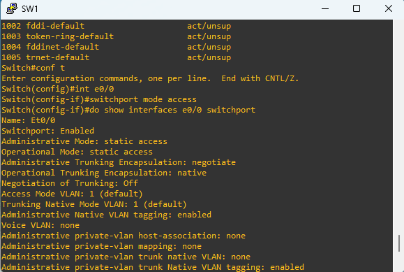
---

* The first things that catch our attention here are the administrative mode and operational mode outputs.
* Administrative mode indicates that the switchport is in access mode as "static access". We will explain operational mode in the Dynamic Trunking Protocol (DTP) section, which we will cover in later labs.
* After confirming that our e0/0 switchport is an access port, we must assign VLAN10 to the port.
* The command for this is as follows:

```text
SW(config-if)# switchport access vlan 10
```
---
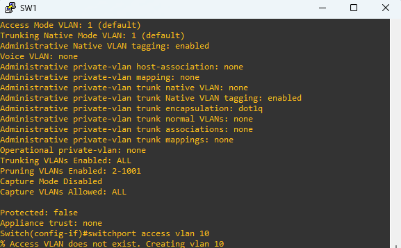
---
* When examining the image, pay attention to the output of the command. It states that VLAN10 does not exist and what was created.
* Assigning a VLAN to a port is another way to create a VLAN.
* If you want to create a VLAN, you can use the following command.

```text
SW(config)# vlan vlan-id
```
* Now let's quickly repeat the process on port e0/1, which is connected to my other VLAN 10 device.
---
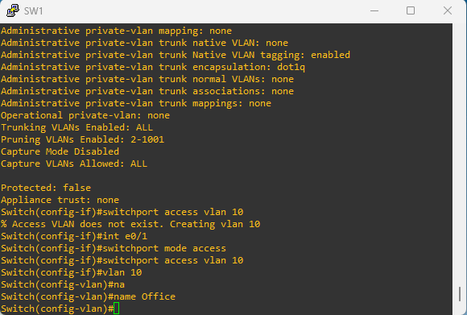
---
* After quickly repeating the process for port e0/1, let's change our VLAN name.
* Now let's look at our SW1 VLANs again.
---
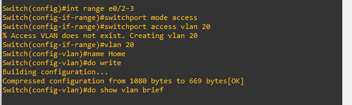
---
* As you can see, VLAN10 has been added and we've named it Office as desired.
* In the Office VLAN, we can see the active ports as e0/0 and e0/1.
* Now, let's quickly assign the remaining access ports for SW1 and SW2.
---
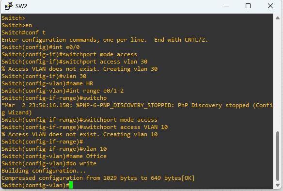
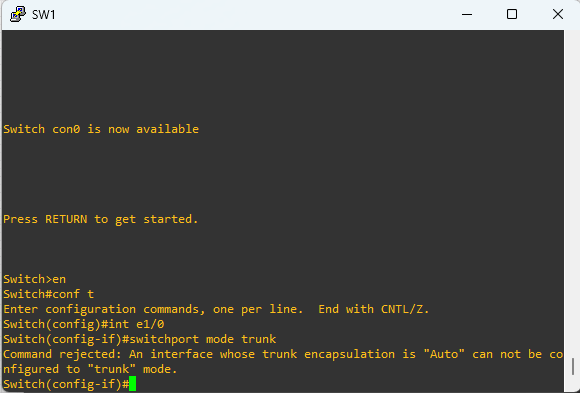
---
* Now let's configure the interfaces connecting the SW1-SW2 line as trunks.
* Why are we configuring trunk interfaces?
* As you can see from the image, traffic from more than one VLAN will pass through the SW1-SW2 link. To ensure this traffic passes smoothly without interference, we need to use tagging.
* Without tagging, in inter-VLAN routing, the switch cannot know which packet belongs to which VLAN.
* It cannot route packets incorrectly.
* Then you might ask, "You said there's no tagging on the access ports, so how will these tagged ports pass through here?"
* Switches know which VLAN the packets from tagged ports belong to and route them accordingly.
* First, let's configure our SW1 e1/0 port as a trunk.
* Our command:

```text
SW1(config)# interface e1/0
SW(config-if)# switchport mode trunk
```
---
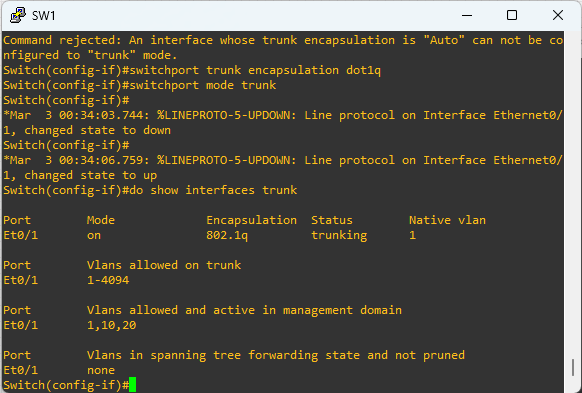
---
* When we try to configure the port as a trunk, we receive a warning: "We cannot configure the port as a trunk because our trunk encapsulation is set to auto."
* First, we need to configure trunk encapsulation to the industry standard dot1q (802.1Q).
* The command for encapsulation configuration is:

```text
SW(config-if)# switchport trunk encapsulation dot1q
```
* Now we can configure our port as a trunk.
* Let's now view the trunk interfaces on SW1 to verify that our port is configured as a trunk. The command for this is:

```text
SW(config)# show interfaces trunk
```
* As you can see, our Ethernet1/0 port is configured as a trunk port, using 802.1Q encapsulation, and its native VLAN is 1.
* What is a native VLAN and what is it used for?
* In trunk ports, packets are carried with tags. If you set a VLAN as native, its packets are not tagged. The switch naturally recognizes that it belongs to the native VLAN and routes traffic accordingly.
* It is generally recommended to assign a native VLAN to a VLAN that is not usually used.
* The other things we see are the "VLANs allowed trunk" and "VLANs allowed and active management domain" sections. What do these tell us?
* It is a smart move to limit the VLANs that we allow traffic through the trunk port for security reasons.
* The command we will use to perform this limitation is as follows:
* switchport trunk allowed vlan vlan-numbers
* Allowing traffic through the trunk port to only the VLANs that will pass through it is the correct approach.
* Therefore, we are allowing VLANs 10 (Office) and 20 (Home). Let's also assign our native VLAN to an unused VLAN for now. The command for this is as follows:

```text
SW(config-if)# switchport trunk native vlan vlan-number
```
---
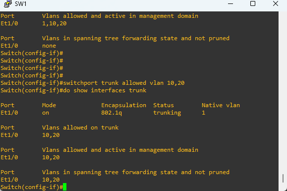
---
* When we changed the native VLAN, we received a Native VLAN mismatch warning like the one shown on the screen.
* In case of native VLAN mismatch, packets may not be transmitted as intended or may even be lost. If the native VLAN on SW1 is 20 and the native VLAN on SW2 is 10, during inter-VLAN routing, the switch may mistake a packet sent to VLAN 10 for a packet from VLAN 20 because it's native VLAN 20.
* Therefore, native VLAN compatibility is important on devices.
* To solve this, let's configure our settings on SW2 immediately.
* So, what is the function of the active in management domain section? It's this: We already mentioned that switches transmit tagged packets through trunk ports during inter-VLAN routing. Therefore, even if the VLANs passing through the trunk port are not connected to our switch, we need to create them on the switch so that it can tag and transmit the packets.
---
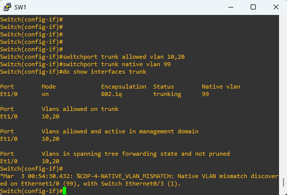
---
* We've completed our configurations in SW2, and as you can see, the mismatch error has been eliminated. We've also defined the VLANs in the SW1 domain in SW2.
---
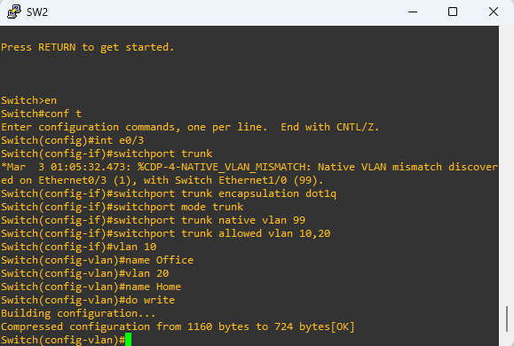
---
* Now let's do the same in SW1 to avoid VLAN mismatch issues.
---
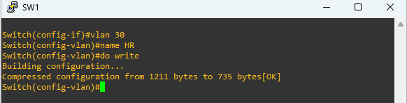
---
* Now let's configure our Ethernet 1/0 port as a trunk port.
---
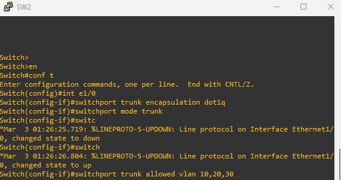
---
* After all, switches (L2) cannot perform inter-VLAN routing.
* Since our router will be forwarding tagged packets when performing inter-VLAN routing, we must make our port a trunk port and configure the allowed VLANs.
---
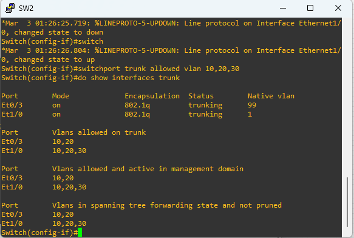
---
* As you can see, we've configured our settings, but I want to draw your attention to something here. If we look at the trunk interfaces using the `show trunk interfaces` command, we'll see that the native VLAN for the e1/0 port is set to 1, which could cause problems.
* To prevent this, let's configure our native VLAN.
---
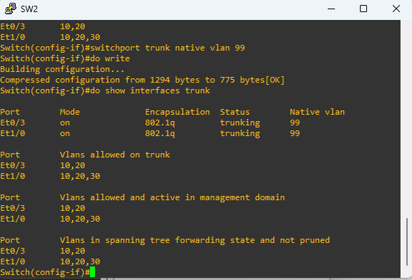
---
* Now we can start configuring on our router. You might ask why we're configuring on the router.
* It's for the same reason we made the SW2 Ethernet 1/0 port a trunk port.
* We didn't need to set the e1/0 port as a trunk; we could have connected 3 links from 3 switches to the router and done inter-VLAN routing that way, but that would be a waste of interfaces and a costly process.
* Actually, we didn't need to use a trunk port at all; we could have just allocated two access ports between SW1 and SW2.
* However, as we said, this isn't a feasible structure in large companies; it could be challenging in terms of cost and control.
* If you ask what we'll do on the router, will we configure a trunk port? No.
* A router on a stick (ROAS) is a system that connects a router and a switch with a single physical interface.
* It appears as a "stick" in a network topology diagram, hence its name. We will perform routing operations through subinterfaces created on the e0/0 interface of R1.
---
 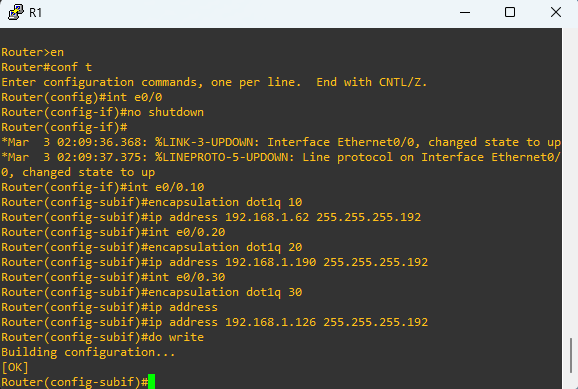
---
* So, what did we do here? First, we activated our interface with `no shutdown`.
* Then, to create the subinterface we will use for VLAN10, we entered the command `interface e0/0.10`.
* Next, to specify the tagging that the router will do during inter-vlan routing, we used the following command: `encapsulation dot1q vlan vlan-id`.
* Finally, we assigned the default gateway addresses for our VLANs.
---
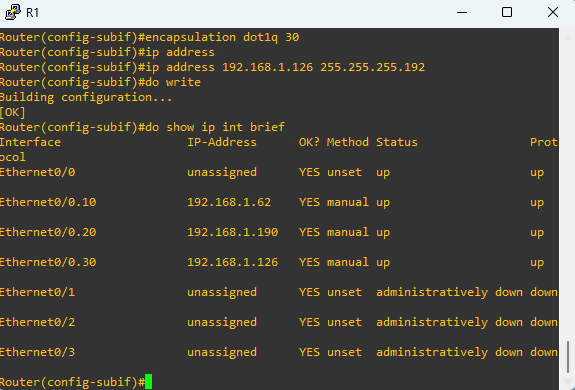
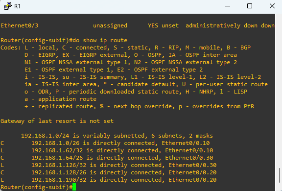
---
* As you can see from the images above, our subinterfaces have been created, and default gateways have been assigned IP addresses to the subinterfaces.
* When we examine the routes, we see that all the necessary steps for inter-VLAN routing have been completed.
* Now let's run a test.
---
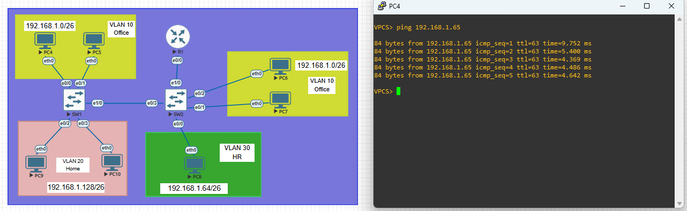
---
## 🚀 Technologies & Tools Used
* Cisco IOS (IOL Router & Switch Images)
* EVE-NG Network Emulator
* IPv4 Subnetting & Network Design
