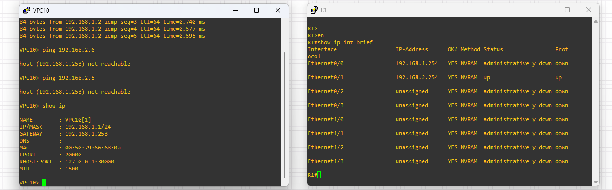
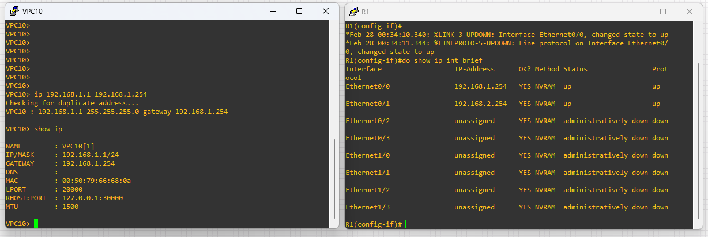
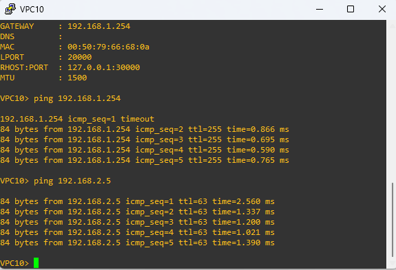

# 🔍 Troubleshooting Lab 01: The Isolated Host & The Silent Gateway

### *Lab 02: Core Forwarding & Path Selection*


---

## 📝 The Scenario
The IT department has received multiple tickets from users regarding connectivity issues. Your mission is to restore full communication between LAN 1 and LAN 2 by identifying and fixing misconfigurations.

### **Reported Symptoms:**
1. **VPC10 (LAN 1):** Cannot reach its own Default Gateway.
2. **VPC6 (LAN 2):** Can reach its gateway but cannot communicate with any device in LAN 1.

---

## 🗺️ Topology Overview
We are using the same infrastructure from the core labs, but with intentional configuration errors.
Note: For the full working version and detailed configuration of this topology, please visit the
[View Core Lab Documentation](../../lab-01-IPv4-Addressing/)


---

## 🕵️ Investigation Phase: Connectivity Testing
To isolate the issue, we performed connectivity tests from different points in the network. The results are captured below:

### **1. Observations from Ping Tests:**


```text
VPC8 (LAN 1): Can ping VPC10 (Internal LAN 1 is OK), but cannot reach LAN 2.

VPC10 (LAN 1): Received host not reachable errors when trying to reach other networks.

VPC6 (LAN 2): Can reach its gateway but receives Destination host unreachable when trying to reach LAN 1.
```

### **2. Analysis & Identification:**
We check the interface status on R1 to see if the paths are active.

Based on these outputs, we identified two primary points of failure:
```text
VPC10 Side: The "host not reachable" error indicates that the device doesn't know where to send the packet because its Default Gateway is misconfigured.

Router Side: Since LAN 2 cannot reach LAN 1 despite having a working gateway, it suggests the Router's LAN 1 interface is either down or disconnected.
```
### **3. Checking Router R1 (The Silent Gateway) & Isolated Host (VPC10)**
We check the interface status on R1 to see if the paths are active.



```text
R1# show ip interface brief
Interface              IP-Address      OK? Method Status                Protocol
Ethernet0/0            192.168.1.254   YES manual administratively down down    <-- 🚩 ISSUE FOUND: Interface is Shutdown
Ethernet0/1            192.168.2.254   YES manual up                    up
```

```text
VPC10> show ip

NAME        : VPC10[1]
IP/MASK     : 192.168.1.1/24
GATEWAY     : 192.168.1.253  <-- 🚩 ISSUE FOUND: The gateway is misconfigured
DNS         :
MAC         : 00:50:79:66:68:0a
LPORT       : 20000
RHOST:PORT  : 127.0.0.1:30000
MTU         : 1500

```

---

## 🛠️ Root Cause Analysis (RCA)
1. **Incorrect Gateway:** VPC10 has an incorrect Default Gateway address (`.253` instead of `.254`), making it unable to leave its local subnet.
2. **Disabled Interface:** R1's interface `Et0/0` is in a `shutdown` state, blocking all traffic from LAN 1 even if the gateway was correct.

---

## ✅ Resolution Steps



### **Fix 1: Correct VPC10 Gateway**
```text
VPC10> ip 192.168.1.1 255.255.255.0 192.168.1.254
VPC10> save
```

### **Fix 2: Enable R1 Interface**
```text
R1# configure terminal
R1(config)# interface Ethernet0/0
R1(config-if)# no shutdown
R1(config-if)# end
R1# write memory
```

---

## 🧪 Final Verification
Once the fixes are applied, we perform an end-to-end connectivity test.



```text
VPC10> ping 192.168.2.5
84 bytes from 192.168.2.5 icmp_seq=1 ttl=63 time=1.124 ms
84 bytes from 192.168.2.5 icmp_seq=2 ttl=63 time=0.985 ms
VPC10> ping 192.168.2.254
84 bytes from 192.168.2.254 icmp_seq=1 ttl=63 time=1.124 ms
84 bytes from 192.168.2.254 icmp_seq=2 ttl=63 time=0.985 ms


**Result:** Inter-VLAN routing is successfully restored! 🎉
```
