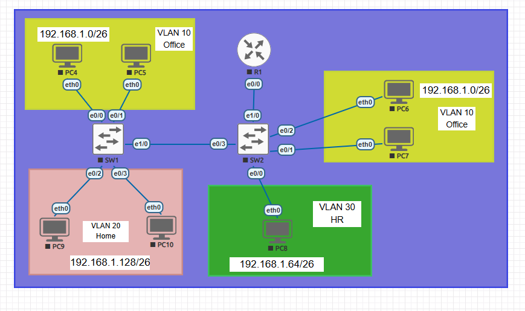
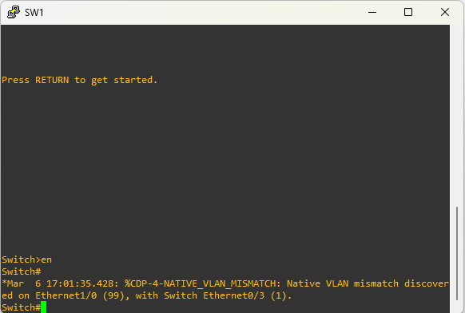
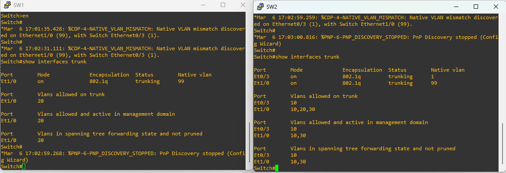

# 🛠️ 🔎 Lab 03: VLANs & Inter-VLAN Routing – Troubleshooting Scenario

---

* Unlike the original lab, this scenario introduces multiple simultaneous failures, asymmetric behavior, trunk inconsistencies, and Layer 3 misconfigurations.

* You are no longer configuring the network.

* You are operating as a Network Engineer during an outage window.

## 🏢 Enterprise Scenario Context
* The company operates a segmented VLAN architecture:

[Download VLANs & Inter-VLAN Routing (.unl)](./VLAN.unl)

| VLAN | Department | Subnet           | Default Gateway |
| ---- | ---------- | ---------------- | --------------- |
| 10   | Office     | 192.168.1.0/26   | 192.168.1.62    |
| 20   | Home       | 192.168.1.128/26 | 192.168.1.190   |
| 30   | HR         | 192.168.1.64/26  | 192.168.1.126   |

### The network uses:

* IEEE 802.1Q trunking

* Router-on-a-Stick (ROAS)

* Cisco IOL images on EVE-NG

* After a weekend maintenance window, multiple tickets were opened.
## 🎫 Active Enterprise Incident Tickets
| Ticket ID | Severity | Description                                                                         |
| --------- | -------- | ----------------------------------------------------------------------------------- |
| INC-101   | High     | Office users on SW1 cannot communicate with Office users on SW2. Gateway reachable. |
| INC-102   | Critical | HR department completely isolated. Cannot ping gateway.                             |
| INC-103   | Medium   | Intermittent packet loss between VLAN 10 and VLAN 20.                               |
| INC-104   | Low      | Console flooded with CDP Native VLAN mismatch warnings.                             |
| INC-105   | High     | Home VLAN can reach Office, but Office cannot reach Home.                           |

## 🚨 Scenario Background

* The physical topology remains exactly the same as the original lab. The IP subnetting scheme (`192.168.1.0/24` divided into `/26` subnets) and the intended VLAN assignments are unchanged. 
* However, users are reporting several connectivity issues this morning.

## 🎯 Objective

### Restore full:

* Layer 2 connectivity

* Inter-VLAN routing

* Trunk consistency

* Bidirectional communication

* Without changing topology.

---
## 🧩 Hidden Misconfigurations (Multi-Failure Design)
* This lab intentionally includes five simultaneous configuration errors.

## 🛠️ Troubleshooting Steps

* As soon as we enter the CLI, we see the following warning in the console line. We can tell it's a warning from its severity level.
* *Mar  6 17:02:31.111: %CDP-4-NATIVE_VLAN_MISMATCH: Native VLAN mismatch discovered on Ethernet1/0 (99), with Switch Ethernet0/3 (1).
* The severity level, the next value after facility (CDP), is 4.
* The warning indicates a VLAN mismatch. We've already discussed the problems that VLAN mismatches can cause, so let's fix it.

* You can find out which VLAN has the error by using the SHOW INTERFACES TRUNK command. Or, if you look at the output, one of the ports is VLAN1 "(1)" while the other is VLAN99 (99).
* Since we want to use VLAN 99, let's change the native VLAN for switch2 e0/3 port.
* 

