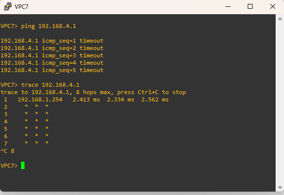
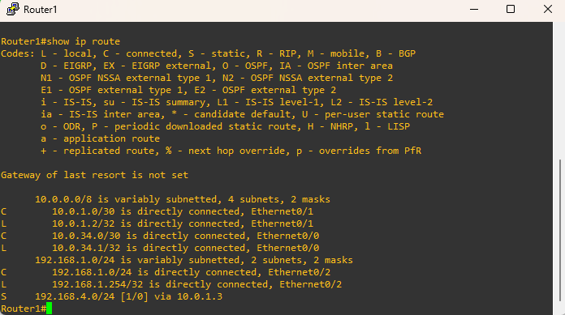
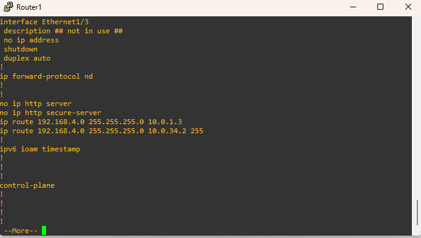

# 🛠️ Troubleshooting Scenario: Multi-Hop Static Routing & Redundancy
### *Lab 02: Core Forwarding & Path Selection*

---

## 📝 Scenario Overview
The organization has deployed a square-topology core network connecting two main sites: **Blue LAN (192.168.1.0/24)** and **Green LAN (192.168.4.0/24)**. The network is designed with redundancy, allowing traffic to flow either through the upper path (R1-R3) or the lower path (R1-R2-R4).

Currently, the junior administrator has applied several static routes, but **VPC7 cannot reach VPC8**, and the redundancy is not working as expected.

---

## 🗺️ Topology Overview
We are using the same infrastructure from the core labs, but with intentional configuration errors.
Note: For the full working version and detailed configuration of this topology, please visit the
[View Core Lab Documentation](../../lab-02-Routing-Fundamentals-&-Static-Routing/)

---

## 🚩 Problem Statements
1.  **Connectivity Failure:** `VPC7` (192.168.1.1) cannot ping `VPC8` (192.168.4.1).
2.  **Partial Reachability:** `Router1` can ping `10.0.1.1` (R3), but cannot reach the interface `10.0.22.1` on the same router.
3.  **Redundancy Issue:** When the link between `R1` and `R3` is manually disabled, the traffic does not automatically switch to the path through `R2`.

---

## 🛠️ Fault Inventory (The "Bugs" to Fix)
* **Next-Hop Mismatch:** On `Router1`, the route to `192.168.4.0/24` points to a non-existent IP in the `10.0.1.0/30` subnet.
* **Missing Return Routes:** `Router4` and `Router3` do not have a route back to the `192.168.1.0/24` network.
* **Subnet Mask Error:** The link between `R3` and `R4` (`10.0.22.0/30`) has an incorrect mask on one side, causing an ARP failure.
* **Floating Static Route:** The backup route through `R2` has the default AD (1), preventing it from acting as a standby.

---

## 🛰️ Topology Details
| Segment | Network | Key IPs |
| :--- | :--- | :--- |
| **Blue LAN** | `192.168.1.0/24` | VPC7: .1, R1-e0/2: .254 |
| **Green LAN** | `192.168.4.0/24` | VPC8: .1, R4-e0/0: .254 |
| **R1 - R3 Link** | `10.0.1.0/30` | R1-e0/1: .2, R3-e0/1: .1 |
| **R1 - R2 Link** | `10.0.34.0/30` | R1-e0/0: .1, R2-e0/0: .2 |
| **R2 - R4 Link** | `10.0.12.0/30` | R2-e0/1: .1, R4-e0/1: .2 |
| **R3 - R4 Link** | `10.0.22.0/30` | R3-e0/2: .2, R4-e0/2: .1 |

---

## 🔍 Troubleshooting Steps

## 🔎 Step 1: Initial Connectivity Analysis
* **Objective:** Confirm the scope of the connectivity failure from the source host.

* **Connectivity Test:** A ping from VPC7 to the destination VPC8 (192.168.4.1) results in a 100% packet loss with multiple timeouts.

* **Path Discovery:** To isolate where the packets are being dropped, a trace 192.168.4.1 was initiated from VPC7.
    
* **The Bottleneck:** The traceroute output shows that the packet successfully reaches the first hop, 192.168.1.254 (the default gateway), but cannot proceed any further, resulting in timeouts for all subsequent hops.

* **Conclusion:** Since 192.168.1.254 is the IP address assigned to Router1's Ethernet0/2 interface, the investigation must move to Router1 to identify why it is failing to forward traffic toward the destination network.

## 🔎 Step 2: Investigating Router 1 (R1) Status
* **Objective:** Audit the interface health and routing logic on the gateway router.

* **Interface Verification:**
* Running show ip int brief on Router1 confirms that all relevant interfaces (Eth0/0, Eth0/1, and Eth0/2) are in an up/up status and have the correct IP addresses assigned according to the topology.
  

* **Routing Table Audit:**
* A show ip route command was executed to verify if Router1 knows how to reach the 192.168.4.0/24 network.
  

* **Identifying the Misconfiguration:**
* The routing table reveals a static route for the destination, but it is configured with an incorrect next-hop of 10.0.1.3.
* Also, route 10.0.34.2 is not visible in the routing table. Let's check the running-config to see if that's the case.
 
* **The Next-Hop Mismatch (Primary Path):**
 * Per the network topology, the valid next-hop on that segment is R3 at 10.0.1.1; therefore, Router1 is attempting to forward traffic to a non-existent IP address.
 *  According to the network topology, the link between Router1 and Router3 uses the $10.0.1.0/30$ subnet.
 *  In a $/30$ network, the only usable host IP addresses are .1 and .2.Impact: The IP $10.0.1.3$ is the broadcast address for that segment, not a valid host.
 *  Consequently, Router1 is attempting to forward traffic to an IP that does not exist as a functional gateway, causing the traceroute to fail immediately after the first hop.
* **The "Hidden" AD 255 Bug (Backup Path) :**
 * The running configuration reveals a second static route intended to provide redundancy via Router2 ($10.0.34.2$).
 * This route is configured with an Administrative Distance (AD) of 255: ip route 192.168.4.0   255.255.255.0 10.0.34.2 255.
 * Impact: In Cisco IOS, an AD of 255 indicates that the route is "untrustworthy". Routes with this value are never installed in the routing table, which is why only the "broken" $10.0.1.3$ route appears in the show ip route output.
* **Solution:**
  
---

## ✅ Success Criteria
- [ ] Successful ping from `VPC7` to `VPC8`.
- [ ] `traceroute` confirms traffic follows the path: `R1 -> R3 -> R4`.
- [ ] If `R1-e0/1` is shut down, `traceroute` should show the path through `R2`.

---

